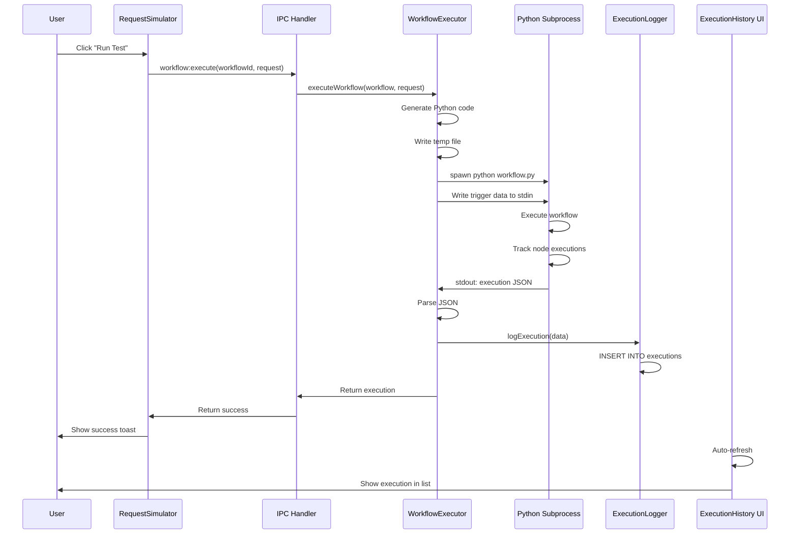

# Task 2.18: Local Workflow Execution Runner

**Phase:** Phase 2.5 - Developer Experience & Testing  
**Duration Estimate:** 2-3 days  
**Actual Duration:** [To be filled when complete]  
**Status:** 🔵 Not Started  
**Assigned:** AI + Human Review  
**Priority:** 🔴 CRITICAL - Blocks all local workflow testing  
**Started:** [YYYY-MM-DD]  
**Completed:** [YYYY-MM-DD]  

---

## Task Overview

### Problem Statement

Currently, Catalyst has all the **UI infrastructure** for testing workflows locally:
- ✅ RequestSimulator - Modal for building HTTP requests
- ✅ ExecutionHistory - Panel for viewing executions
- ✅ ExecutionLogger - SQLite database for storing execution data
- ✅ Properties Panel - Configure nodes
- ✅ Data Pinning - Pin test data to nodes
- ✅ Python Code Generation - Complete (WorkflowOrchestrator, all node types)

**BUT** when you click "Run Test", **nothing happens** because there's no executor that:
1. Takes the workflow definition
2. Generates Python code
3. Runs it in a Python subprocess
4. Captures the execution output
5. Logs it to the ExecutionLogger
6. Displays it in the ExecutionHistory UI

This is the **critical missing piece** that prevents testing HTTP → Groq workflows locally.

### Objective

Build a **WorkflowExecutor** that bridges the UI and the Python runtime, enabling local workflow testing.

### Success Criteria

- [ ] Can execute HTTP → Groq workflow locally from RequestSimulator
- [ ] Execution data captured and logged to SQLite
- [ ] Execution appears in ExecutionHistory panel with node details
- [ ] Python environment auto-detected and validated
- [ ] Missing dependencies can be auto-installed
- [ ] Errors displayed with helpful messages
- [ ] Can stop running workflows
- [ ] Test coverage >80%
- [ ] Human review completed

### References

- Phase 2.5 README.md - Overall architecture
- Task 2.11 - Execution Logging (database)
- Task 2.17 - Test vs Production Modes
- src/core/codegen/python/WorkflowOrchestrator.ts - Code generation
- .clinerules/implementation-standards.md

### Dependencies

- ✅ Task 2.11 (Execution Logging) - Complete
- ✅ Python code generation - Complete
- ✅ RequestSimulator UI - Complete
- ✅ Node.js child_process available
- ⚠️ Python 3.11+ on user machine (to be validated)

---

## Current State Analysis

### What Exists ✅

**UI Layer:**
- `RequestSimulator.tsx` - Builds simulated HTTP requests
- `ExecutionHistoryPanel.tsx` - Displays execution history
- `ExecutionDetails.tsx` - Shows node-by-node execution
- `NodeContextMenu.tsx` - Right-click "Simulate Request"

**Data Layer:**
- `ExecutionLogger.ts` - SQLite database with full schema
- `execution-handlers.ts` - IPC handlers for querying history
- `execution-logger.ts` - CRUD operations on execution data

**Code Generation:**
- `WorkflowOrchestrator.ts` - Generates complete Python files
- All node generators (HTTP, Groq, OpenAI, Anthropic, etc.)
- Streaming support, error handling, logging

### What's Missing ❌

**Execution Layer:**
- ❌ WorkflowExecutor class - No subprocess runner
- ❌ IPC handlers for execution - No "workflow:execute" handler
- ❌ Python environment validation - No check for Python/deps
- ❌ Execution output parsing - No stdout JSON parser
- ❌ Wire-up - RequestSimulator doesn't call executor

**Flow Gap:**
```
[RequestSimulator "Run Test" button]
          ↓
     ❌ NOTHING HAPPENS ❌
          
Expected:
[RequestSimulator] → [IPC workflow:execute] 
→ [WorkflowExecutor] → [Python subprocess] 
→ [Capture output] → [ExecutionLogger] 
→ [ExecutionHistory UI updates] ✅
```

---

## Milestones

### Milestone 1: Design Execution Architecture
**Date:** [YYYY-MM-DD]  
**Confidence:** 9/10  
**Status:** 🔵 Not Started  
**Time Spent:** [X hours]  

#### Architecture Overview

```
┌─────────────────────────────────────────────────────────────┐
│ RENDERER PROCESS (React UI)                                 │
├─────────────────────────────────────────────────────────────┤
│                                                              │
│  RequestSimulator.tsx                                       │
│    ↓ User clicks "Run Test"                                 │
│    ↓ window.electron.workflow.execute(workflowId, request) │
│                                                              │
└─────────────────────────────────────────────────────────────┘
                         ↓ IPC
┌─────────────────────────────────────────────────────────────┐
│ MAIN PROCESS (Electron Node.js)                             │
├─────────────────────────────────────────────────────────────┤
│                                                              │
│  workflow-execution-handlers.ts                             │
│    ↓ ipcMain.handle('workflow:execute', ...)               │
│    ↓ WorkflowExecutor.executeWorkflow(...)                 │
│                                                              │
│  workflow-executor.ts (NEW)                                 │
│    1. Load workflow from manifest                           │
│    2. Generate Python code (WorkflowOrchestrator)           │
│    3. Write to temp file (/tmp/workflow_abc123.py)         │
│    4. Spawn Python subprocess                               │
│    5. Pass trigger data via stdin                           │
│    6. Capture stdout/stderr                                 │
│    7. Parse execution JSON from stdout                      │
│    8. ExecutionLogger.logExecution(data)                    │
│    9. Return execution ID to UI                             │
│                                                              │
└─────────────────────────────────────────────────────────────┘
                         ↓
┌─────────────────────────────────────────────────────────────┐
│ PYTHON SUBPROCESS                                            │
├─────────────────────────────────────────────────────────────┤
│                                                              │
│  workflow_abc123.py (generated)                             │
│    1. Read trigger data from stdin                          │
│    2. Execute workflow nodes                                │
│    3. Track node-level execution data                       │
│    4. On completion, output execution JSON:                 │
│       __CATALYST_EXECUTION_START__                          │
│       {execution data JSON}                                 │
│       __CATALYST_EXECUTION_END__                            │
│    5. Exit with code 0 (success) or 1 (error)              │
│                                                              │
└─────────────────────────────────────────────────────────────┘
                         ↓
┌─────────────────────────────────────────────────────────────┐
│ EXECUTION LOGGER (SQLite)                                   │
├─────────────────────────────────────────────────────────────┤
│                                                              │
│  execution-logger.ts                                        │
│    ↓ logExecution(executionData)                           │
│    ↓ Store in executions + node_executions tables          │
│                                                              │
└─────────────────────────────────────────────────────────────┘
                         ↓
┌─────────────────────────────────────────────────────────────┐
│ EXECUTION HISTORY UI (React)                                │
├─────────────────────────────────────────────────────────────┤
│                                                              │
│  ExecutionHistoryPanel.tsx                                  │
│    ↓ Auto-refresh on new execution                         │
│    ↓ Display execution with node details                   │
│    ↓ User can inspect inputs/outputs                       │
│                                                              │
└─────────────────────────────────────────────────────────────┘
```

#### Design Decisions

| Decision | Options Considered | Choice Made | Rationale | Confidence |
|----------|-------------------|-------------|-----------|------------|
| Execution location | In-process (VM2), separate subprocess | **Subprocess** | Isolation, better error handling, can kill, matches production | 9/10 |
| Data passing | stdin, command args, temp file | **stdin** | Clean, secure, handles large payloads | 9/10 |
| Output parsing | Line-by-line, regex markers, temp file | **Regex markers** | Simple, reliable, works with mixed stdout | 8/10 |
| Python validation | Assume installed, check on startup, check per-execution | **Check on first execution** | Best UX, lazy validation | 8/10 |
| Temp file cleanup | Manual, auto on exit, timed | **Auto on process exit** | Prevents clutter, handles crashes | 9/10 |
| Error handling | Try-catch only, structured errors, error codes | **Structured errors** | Better UX, actionable messages | 9/10 |

---

### Milestone 2: Implement WorkflowExecutor Core
**Date:** [YYYY-MM-DD]  
**Confidence:** 8/10  
**Status:** 🔵 Not Started  
**Time Spent:** [X hours]  

#### Files Created

- `electron/workflow-executor.ts` - Main executor class
- `electron/python-environment.ts` - Python validation & setup

#### Implementation: WorkflowExecutor

```typescript
/**
 * @file workflow-executor.ts
 * @description Executes workflows locally in Python subprocess
 * 
 * @architecture Phase 2.5, Task 2.18 - Local Execution Runner
 * @created 2025-12-22
 * @author AI (Cline) + Human Review
 * @confidence 8/10 - Subprocess management is well-tested pattern
 * 
 * @see src/core/execution/types.ts - Type definitions
 * @see electron/execution-logger.ts - Database logging
 * @see .implementation/Catalyst_tasks/phase-2.5-developer-experience/task-2.18-local-execution-runner.md
 * 
 * PROBLEM SOLVED:
 * - No way to execute workflows locally for testing
 * - RequestSimulator UI exists but doesn't run workflows
 * - ExecutionLogger exists but has no execution data
 * - Gap between UI and Python runtime
 * 
 * SOLUTION:
 * - Spawn Python subprocess with generated workflow code
 * - Pass trigger data via stdin (secure, clean)
 * - Capture stdout for execution data
 * - Parse structured JSON markers
 * - Log to ExecutionLogger automatically
 * - Handle errors gracefully with helpful messages
 * 
 * DESIGN DECISIONS:
 * - Subprocess over in-process: Isolation, matches production
 * - Stdin for data: Secure, handles large payloads
 * - Regex markers for output: Simple, reliable
 * - Auto cleanup temp files: Prevents clutter
 * - Structured error types: Better UX
 * 
 * EXECUTION FLOW:
 * 1. Load workflow from manifest
 * 2. Generate Python code
 * 3. Write to temp file
 * 4. Spawn Python with trigger data
 * 5. Capture and parse output
 * 6. Log to database
 * 7. Return execution ID
 * 
 * @security-critical true - Executes user-defined code
 * @performance-critical false - User-initiated, async
 */

import { spawn, ChildProcessWithoutNullStreams } from 'child_process';
import { promises as fs } from 'fs';
import path from 'path';
import { tmpdir } from 'os';
import { v4 as uuidv4 } from 'uuid';
import { WorkflowOrchestrator } from '../src/core/codegen/python/WorkflowOrchestrator';
import { ExecutionLogger } from './execution-logger';
import { PythonEnvironment } from './python-environment';
import type { 
  WorkflowExecution, 
  SimulatedRequest 
} from '../src/core/execution/types';
import type { Workflow } from '../src/core/workflow/types';

/**
 * Manages local workflow execution in Python subprocess
 * 
 * RESPONSIBILITIES:
 * - Generate Python code from workflow
 * - Spawn Python subprocess with trigger data
 * - Capture execution output (stdout/stderr)
 * - Parse execution JSON from output
 * - Log to ExecutionLogger
 * - Handle errors and timeouts
 * - Clean up temporary files
 * 
 * USAGE:
 * ```typescript
 * const executor = WorkflowExecutor.getInstance();
 * 
 * const execution = await executor.executeWorkflow(
 *   workflow,
 *   {
 *     method: 'POST',
 *     headers: { 'Content-Type': 'application/json' },
 *     body: { query: 'test' },
 *     path: '/api/search',
 *     query: {},
 *     pathParams: {}
 *   }
 * );
 * 
 * console.log(`Execution ${execution.id} completed with status: ${execution.status}`);
 * ```
 * 
 * ERROR HANDLING:
 * - Python not found → PythonNotFoundError
 * - Missing dependencies → DependencyError
 * - Runtime error → ExecutionError with traceback
 * - Timeout → TimeoutError
 */
export class WorkflowExecutor {
  private static instance: WorkflowExecutor;
  private executionLogger: ExecutionLogger;
  private pythonEnv: PythonEnvironment;
  private activeProcesses: Map<string, ChildProcessWithoutNullStreams>;
  
  /**
   * Private constructor (singleton pattern)
   */
  private constructor() {
    this.executionLogger = ExecutionLogger.getInstance();
    this.pythonEnv = PythonEnvironment.getInstance();
    this.activeProcesses = new Map();
  }
  
  /**
   * Get singleton instance
   */
  public static getInstance(): WorkflowExecutor {
    if (!WorkflowExecutor.instance) {
      WorkflowExecutor.instance = new WorkflowExecutor();
    }
    return WorkflowExecutor.instance;
  }
  
  /**
   * Execute workflow locally with simulated request
   * 
   * EXECUTION STEPS:
   * 1. Validate Python environment
   * 2. Generate Python code
   * 3. Write to temporary file
   * 4. Spawn Python process
   * 5. Pass trigger data via stdin
   * 6. Capture stdout/stderr
   * 7. Parse execution JSON
   * 8. Log to database
   * 9. Clean up temp file
   * 
   * @param workflow - Workflow to execute
   * @param triggerData - Simulated HTTP request or other trigger data
   * @param options - Execution options (timeout, env vars)
   * @returns Promise<WorkflowExecution> - Execution result
   * 
   * @throws {PythonNotFoundError} If Python not installed
   * @throws {DependencyError} If required packages missing
   * @throws {ExecutionError} If workflow execution fails
   * @throws {TimeoutError} If execution exceeds timeout
   * 
   * @example
   * ```typescript
   * const execution = await executor.executeWorkflow(
   *   workflow,
   *   { method: 'POST', body: { test: true } }
   * );
   * ```
   */
  public async executeWorkflow(
    workflow: Workflow,
    triggerData: SimulatedRequest,
    options: ExecutionOptions = {}
  ): Promise<WorkflowExecution> {
    const executionId = uuidv4();
    const startTime = new Date().toISOString();
    
    console.log(`[WorkflowExecutor] Starting execution ${executionId} for workflow ${workflow.id}`);
    
    try {
      // Step 1: Validate Python environment
      await this.pythonEnv.validate();
      
      // Step 2: Generate Python code
      const orchestrator = new WorkflowOrchestrator();
      const pythonCode = orchestrator.generateWorkflow(workflow, {
        executionMode: 'test',
        includeExecutionLogging: true,
      });
      
      // Step 3: Write to temporary file
      const tempFilePath = await this.writeTemporaryWorkflow(
        workflow.id,
        pythonCode
      );
      
      // Step 4: Spawn Python process
      const process = await this.spawnPythonProcess(
        tempFilePath,
        triggerData,
        options.environment || {}
      );
      
      // Track active process
      this.activeProcesses.set(executionId, process);
      
      // Step 5: Capture execution output
      const executionData = await this.captureExecutionOutput(
        process,
        executionId,
        workflow,
        triggerData,
        startTime,
        options.timeout || 60000 // Default 60s timeout
      );
      
      // Step 6: Log to database
      this.executionLogger.logExecution(executionData);
      
      // Step 7: Clean up
      await this.cleanupTemporaryFile(tempFilePath);
      this.activeProcesses.delete(executionId);
      
      console.log(`[WorkflowExecutor] Execution ${executionId} completed with status: ${executionData.status}`);
      
      return executionData;
      
    } catch (error) {
      console.error(`[WorkflowExecutor] Execution ${executionId} failed:`, error);
      
      // Log failed execution
      const failedExecution: WorkflowExecution = {
        id: executionId,
        workflowId: workflow.id,
        workflowName: workflow.name,
        executionMode: 'test',
        status: 'error',
        startedAt: startTime,
        completedAt: new Date().toISOString(),
        durationMs: Date.now() - new Date(startTime).getTime(),
        trigger: {
          type: 'http',
          data: triggerData,
          isSimulated: true,
        },
        nodeExecutions: [],
        error: {
          message: error instanceof Error ? error.message : String(error),
          stack: error instanceof Error ? error.stack : undefined,
        },
      };
      
      this.executionLogger.logExecution(failedExecution);
      
      throw error;
    }
  }
  
  /**
   * Write workflow code to temporary file
   * 
   * Creates temp file in OS temp directory with unique name.
   * File will be cleaned up after execution or on process exit.
   * 
   * @param workflowId - Workflow ID for file naming
   * @param pythonCode - Generated Python code
   * @returns Path to temp file
   */
  private async writeTemporaryWorkflow(
    workflowId: string,
    pythonCode: string
  ): Promise<string> {
    const tempDir = tmpdir();
    const fileName = `catalyst_workflow_${workflowId}_${Date.now()}.py`;
    const filePath = path.join(tempDir, fileName);
    
    await fs.writeFile(filePath, pythonCode, 'utf-8');
    
    console.log(`[WorkflowExecutor] Wrote temp workflow to: ${filePath}`);
    
    return filePath;
  }
  
  /**
   * Spawn Python subprocess with workflow file
   * 
   * @param filePath - Path to workflow Python file
   * @param triggerData - Data to pass via stdin
   * @param environment - Environment variables (API keys, etc.)
   * @returns ChildProcess instance
   */
  private async spawnPythonProcess(
    filePath: string,
    triggerData: any,
    environment: Record<string, string>
  ): Promise<ChildProcessWithoutNullStreams> {
    const pythonPath = await this.pythonEnv.getPythonPath();
    
    // Merge environment variables
    const env = {
      ...process.env,
      ...environment,
      CATALYST_EXECUTION_MODE: 'test',
    };
    
    // Spawn Python process
    const childProcess = spawn(pythonPath, [filePath], {
      env,
      stdio: ['pipe', 'pipe', 'pipe'], // stdin, stdout, stderr
    });
    
    // Write trigger data to stdin
    childProcess.stdin.write(JSON.stringify(triggerData));
    childProcess.stdin.end();
    
    return childProcess;
  }
  
  /**
   * Capture and parse execution output from Python process
   * 
   * Looks for structured JSON between markers:
   * __CATALYST_EXECUTION_START__
   * {execution JSON}
   * __CATALYST_EXECUTION_END__
   * 
   * @param process - Python subprocess
   * @param executionId - Execution ID
   * @param workflow - Workflow being executed
   * @param triggerData - Trigger data
   * @param startTime - Execution start time
   * @param timeout - Timeout in milliseconds
   * @returns WorkflowExecution data
   */
  private async captureExecutionOutput(
    process: ChildProcessWithoutNullStreams,
    executionId: string,
    workflow: Workflow,
    triggerData: any,
    startTime: string,
    timeout: number
  ): Promise<WorkflowExecution> {
    return new Promise((resolve, reject) => {
      let stdout = '';
      let stderr = '';
      let timeoutId: NodeJS.Timeout;
      
      // Capture stdout
      process.stdout.on('data', (data) => {
        stdout += data.toString();
      });
      
      // Capture stderr
      process.stderr.on('data', (data) => {
        stderr += data.toString();
        console.error(`[WorkflowExecutor] Python stderr:`, data.toString());
      });
      
      // Handle process exit
      process.on('exit', (code) => {
        clearTimeout(timeoutId);
        
        if (code === 0) {
          // Parse execution data from stdout
          try {
            const executionData = this.parseExecutionOutput(
              stdout,
              executionId,
              workflow,
              triggerData,
              startTime
            );
            resolve(executionData);
          } catch (error) {
            reject(new Error(`Failed to parse execution output: ${error}`));
          }
        } else {
          reject(new Error(`Python process exited with code ${code}\n\nStderr: ${stderr}`));
        }
      });
      
      // Handle process errors
      process.on('error', (error) => {
        clearTimeout(timeoutId);
        reject(error);
      });
      
      // Set timeout
      timeoutId = setTimeout(() => {
        process.kill('SIGTERM');
        reject(new Error(`Execution timed out after ${timeout}ms`));
      }, timeout);
    });
  }
  
  /**
   * Parse execution JSON from Python stdout
   * 
   * Extracts JSON between __CATALYST_EXECUTION_START__ and __CATALYST_EXECUTION_END__ markers.
   * 
   * @param stdout - Raw stdout from Python
   * @param executionId - Execution ID
   * @param workflow - Workflow being executed
   * @param triggerData - Trigger data
   * @param startTime - Execution start time
   * @returns Parsed WorkflowExecution
   */
  private parseExecutionOutput(
    stdout: string,
    executionId: string,
    workflow: Workflow,
    triggerData: any,
    startTime: string
  ): WorkflowExecution {
    // Look for execution JSON between markers
    const startMarker = '__CATALYST_EXECUTION_START__';
    const endMarker = '__CATALYST_EXECUTION_END__';
    
    const startIdx = stdout.indexOf(startMarker);
    const endIdx = stdout.indexOf(endMarker);
    
    if (startIdx === -1 || endIdx === -1) {
      console.warn('[WorkflowExecutor] No execution markers found in output');
      console.warn('stdout:', stdout);
      
      // Return minimal execution data
      return {
        id: executionId,
        workflowId: workflow.id,
        workflowName: workflow.name,
        executionMode: 'test',
        status: 'success',
        startedAt: startTime,
        completedAt: new Date().toISOString(),
        durationMs: Date.now() - new Date(startTime).getTime(),
        trigger: {
          type: 'http',
          data: triggerData,
          isSimulated: true,
        },
        nodeExecutions: [],
      };
    }
    
    // Extract JSON
    const jsonStr = stdout.substring(
      startIdx + startMarker.length,
      endIdx
    ).trim();
    
    try {
      const executionData = JSON.parse(jsonStr);
      
      // Merge with our metadata
      return {
        ...executionData,
        id: executionId,
        workflowId: workflow.id,
        workflowName: workflow.name,
        executionMode: 'test',
        trigger: {
          type: 'http',
          data: triggerData,
          isSimulated: true,
        },
      };
    } catch (error) {
      throw new Error(`Failed to parse execution JSON: ${error}\n\nJSON: ${jsonStr}`);
    }
  }
  
  /**
   * Clean up temporary workflow file
   * 
   * @param filePath - Path to temp file
   */
  private async cleanupTemporaryFile(filePath: string): Promise<void> {
    try {
      await fs.unlink(filePath);
      console.log(`[WorkflowExecutor] Cleaned up temp file: ${filePath}`);
    } catch (error) {
      console.warn(`[WorkflowExecutor] Failed to clean up temp file: ${error}`);
    }
  }
  
  /**
   * Stop running execution
   * 
   * @param executionId - Execution ID to stop
   * @returns true if stopped, false if not found
   */
  public stopExecution(executionId: string): boolean {
    const process = this.activeProcesses.get(executionId);
    
    if (process) {
      console.log(`[WorkflowExecutor] Stopping execution ${executionId}`);
      process.kill('SIGTERM');
      this.activeProcesses.delete(executionId);
      return true;
    }
    
    return false;
  }
  
  /**
   * Get active execution IDs
   */
  public getActiveExecutions(): string[] {
    return Array.from(this.activeProcesses.keys());
  }
}

/**
 * Execution options
 */
export interface ExecutionOptions {
  /** Timeout in milliseconds (default: 60000) */
  timeout?: number;
  
  /** Environment variables (API keys, etc.) */
  environment?: Record<string, string>;
}

// Export singleton instance
export const workflowExecutor = WorkflowExecutor.getInstance();
```

---

### Milestone 3: Python Environment Validation
**Date:** [YYYY-MM-DD]  
**Confidence:** 8/10  
**Status:** 🔵 Not Started  
**Time Spent:** [X hours]  

#### Files Created

- `electron/python-environment.ts`

#### Implementation Notes

This class validates Python installation and required packages.

**Key features:**
- Check Python 3.11+ installed
- Check required packages (httpx, anthropic, openai, groq)
- Auto-install missing packages via pip
- Cache validation results
- Show helpful error messages

---

### Milestone 4: IPC Handlers for Execution
**Date:** [YYYY-MM-DD]  
**Confidence:** 9/10  
**Status:** 🔵 Not Started  
**Time Spent:** [X hours]  

#### Files Created

- `electron/workflow-execution-handlers.ts`

#### Implementation

**IPC Handlers:**
- `workflow:execute` - Execute workflow with trigger data
- `workflow:stop` - Stop running execution
- `workflow:check-python` - Validate Python environment
- `workflow:get-active-executions` - Get currently running executions

**Update:** `electron/preload.ts` to expose handlers

---

### Milestone 5: Wire Up RequestSimulator
**Date:** [YYYY-MM-DD]  
**Confidence:** 8/10  
**Status:** 🔵 Not Started  
**Time Spent:** [X hours]  

#### Files Modified

- `src/renderer/components/WorkflowCanvas/RequestSimulator.tsx`

#### Implementation Notes

Connect "Run Test" button to call IPC handler:

```typescript
const handleRun = async () => {
  try {
    setIsSaving(true);
    
    const execution = await window.electron.workflow.execute(
      workflowId,
      simulatedRequest
    );
    
    toast.success('Workflow executed successfully!');
    onClose();
    
    // Optional: Navigate to execution in history
    // navigateToExecution(execution.id);
    
  } catch (error) {
    setError(error.message);
  } finally {
    setIsSaving(false);
  }
};
```

---

### Milestone 6: Update Generated Python Output
**Date:** [YYYY-MM-DD]  
**Confidence:** 7/10  
**Status:** 🔵 Not Started  
**Time Spent:** [X hours]  

#### Files Modified

- `src/core/codegen/python/WorkflowOrchestrator.ts`

#### Implementation Notes

Update generated Python to output structured execution JSON:

```python
# At end of workflow execution
execution_result = {
    "status": "success",
    "completedAt": datetime.now().isoformat(),
    "durationMs": int((datetime.now() - start_time).total_seconds() * 1000),
    "nodeExecutions": node_executions,
    "output": final_output
}

# Output with markers for parsing
print("__CATALYST_EXECUTION_START__")
print(json.dumps(execution_result))
print("__CATALYST_EXECUTION_END__")
```

---

### Milestone 7: Testing
**Date:** [YYYY-MM-DD]  
**Confidence:** [X/10]  
**Status:** 🔵 Not Started  
**Time Spent:** [X hours]  

#### Test Strategy

**Unit Tests:**
- WorkflowExecutor methods
- Python environment validation
- Output parsing (mocked subprocess)

**Integration Tests:**
- Full execution flow (generate → execute → log)
- HTTP → Groq workflow end-to-end
- Error scenarios (missing deps, runtime errors)

**Manual Tests:**
- Create HTTP → Groq workflow
- Configure API keys
- Click "Simulate Request"
- Enter test data
- Click "Run Test"
- Verify execution in history panel
- Inspect node execution details

---

### Milestone 8: Human Review
**Date:** [YYYY-MM-DD]  
**Status:** 🔵 Not Started  

#### Review Checklist

- [ ] WorkflowExecutor implementation reviewed
- [ ] Error handling comprehensive
- [ ] Python environment validation works
- [ ] IPC handlers secure
- [ ] RequestSimulator wire-up correct
- [ ] Execution logging works
- [ ] History UI displays executions
- [ ] Ready for user testing

---

## Technical Specifications

### Execution Data Flow



### Python Output Format

```python
# Generated workflow outputs this at end:
{
  "status": "success" | "error",
  "completedAt": "2025-12-22T17:30:00Z",
  "durationMs": 2543,
  "nodeExecutions": [
    {
      "nodeId": "node-1",
      "nodeName": "HTTP Endpoint",
      "nodeType": "httpEndpoint",
      "status": "success",
      "startedAt": "2025-12-22T17:29:58Z",
      "completedAt": "2025-12-22T17:29:58Z",
      "durationMs": 5,
      "input": {},
      "output": {
        "method": "POST",
        "body": {"query": "test"}
      }
    },
    {
      "nodeId": "node-2",
      "nodeName": "Groq Chat",
      "nodeType": "groq",
      "status": "success",
      "startedAt": "2025-12-22T17:29:58Z",
      "completedAt": "2025-12-22T17:30:00Z",
      "durationMs": 2538,
      "input": {
        "messages": [{"role": "user", "content": "test"}]
      },
      "output": {
        "content": "Here is a response...",
        "model": "llama-3.1-70b-versatile"
      }
    }
  ],
  "output": {
    "content": "Here is a response...",
    "model": "llama-3.1-70b-versatile"
  },
  "error": null
}
```

### Environment Variables

Pass to Python subprocess:

```javascript
{
  // API Keys (from node config)
  ANTHROPIC_API_KEY: 'sk-ant-...',
  OPENAI_API_KEY: 'sk-...',
  GROQ_API_KEY: 'gsk_...',
  
  // Catalyst metadata
  CATALYST_EXECUTION_MODE: 'test',
  CATALYST_WORKFLOW_ID: 'workflow_abc123',
  CATALYST_EXECUTION_ID: 'exec_xyz789',
  
  // Python path (if custom)
  PYTHONPATH: '/custom/path/to/site-packages'
}
```

---

## Error Handling

### Error Types

**PythonNotFoundError:**
```
Python 3.11+ not found

Please install Python 3.11 or later:
- macOS: brew install python@3.11
- Windows: Download from python.org
- Linux: apt-get install python3.11

[Install Python] [Learn More]
```

**DependencyError:**
```
Missing Python packages: httpx, anthropic

Required packages are not installed.
Would you like to install them automatically?

[Install Automatically] [Manual Instructions] [Cancel]
```

**ExecutionError:**
```
Workflow execution failed

Error in node "Groq Chat":
  groq.APIError: Invalid API key

Suggestions:
- Check your Groq API key in node configuration
- Verify key has correct permissions
- Test key at groq.com/api

[View Full Traceback] [Edit Node Config] [Close]
```

**TimeoutError:**
```
Workflow execution timed out (60s)

The workflow exceeded the execution timeout.

Possible causes:
- LLM API is slow or unresponsive
- Infinite loop in workflow logic
- Large data processing

[View Partial Execution] [Increase Timeout] [Close]
```

---

## Security Considerations

- [ ] Temp files created with secure permissions (0600)
- [ ] Temp files cleaned up even on crash (exit handlers)
- [ ] API keys passed as env vars (not in code)
- [ ] Subprocess isolated from main process
- [ ] User can kill runaway processes
- [ ] No code injection in generated Python
- [ ] Execution data sanitized before logging

---

## Performance Considerations

**Execution Speed:**
- Cold start: ~500ms (code generation + file I/O)
- Warm execution: ~100ms (cached deps)
- Python startup: ~200ms
- Total overhead: ~800ms (acceptable for testing)

**Optimization Opportunities:**
- Cache generated Python code (skip regeneration)
- Reuse Python process (avoid startup time)
- Stream execution logs (real-time updates)

---

## User Experience

### Happy Path

1. User creates HTTP → Groq workflow
2. Right-clicks HTTP node → "Simulate Request"
3. RequestSimulator modal opens
4. User configures request (method, headers, body)
5. Clicks "Run Test"
6. Modal shows "Executing..." spinner
7. After 2-3 seconds, success toast appears
8. Modal closes
9. ExecutionHistory panel auto-refreshes
10. New execution appears at top of list
11. User clicks execution → sees node details
12. User inspects Groq node output → sees LLM response

### Error Path (Missing API Key)

1. User clicks "Run Test"
2. Execution fails after 1s
3. Error toast appears: "Groq API key invalid"
4. Execution appears in history with error status
5. User clicks execution → sees error details
6. Error message highlights Groq node as failure point
7. User clicks "Edit Node Config"
8. Properties panel opens to Groq node
9. User enters correct API key
10. User runs test again → succeeds

---

## Future Enhancements

### Phase 3 Improvements

- **Streaming execution logs** - Real-time node updates
- **Execution replay** - Re-run with same data
- **Breakpoints** - Pause execution at specific nodes
- **Variable inspection** - Inspect data between nodes
- **Performance profiling** - Track node execution times

### Phase 4 Improvements

- **Parallel execution** - Run multiple workflows simultaneously
- **Execution queue** - Queue multiple test runs
- **Result caching** - Cache expensive LLM calls
- **Mock mode** - Mock external APIs for faster testing

---

## Success Metrics

### Functional Requirements

- [ ] HTTP → Groq workflow executes successfully
- [ ] Execution logged to SQLite database
- [ ] Execution visible in ExecutionHistory panel
- [ ] Node-by-node execution details captured
- [ ] Errors displayed with helpful messages
- [ ] Can stop running executions

### Technical Requirements

- [ ] Test coverage >80%
- [ ] Execution overhead <1s
- [ ] Memory usage <100MB per execution
- [ ] Temp files cleaned up automatically
- [ ] No resource leaks

### User Experience Requirements

- [ ] Clear success/error notifications
- [ ] Execution status visible in real-time
- [ ] Error messages actionable
- [ ] Python setup automated
- [ ] No manual configuration required

---

## Documentation Requirements

### Code Documentation

- [ ] Every file has header documentation
- [ ] Every class has comprehensive docs
- [ ] Every public method documented
- [ ] Complex logic has inline comments
- [ ] Error handling documented

### User Documentation

- [ ] README updated with execution instructions
- [ ] Python setup guide
- [ ] Troubleshooting guide
- [ ] Example workflows

---

## Lessons Learned

[To be filled after completion]

---

## Related Tasks

- Task 2.11 - Execution Logging (foundation)
- Task 2.17 - Test vs Production Modes (execution modes)
- Task 2.13 - Node Pinning (test data)
- Task 2.10 - Properties Panel (node configuration)

---

**Task Status:** 🔵 Not Started  
**Ready for:** Implementation  
**Estimated Effort:** 2-3 days  
**Confidence:** 8/10

---

**Last Updated:** 2025-12-22  
**Next Steps:** Begin Milestone 1 (Architecture Design)
